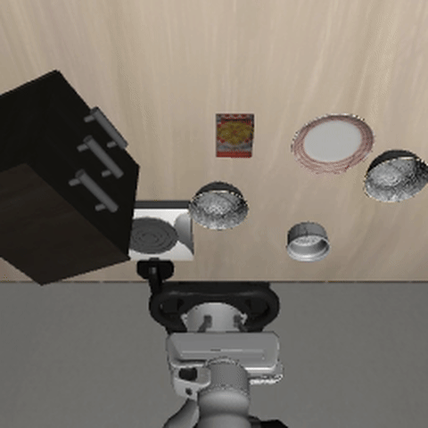
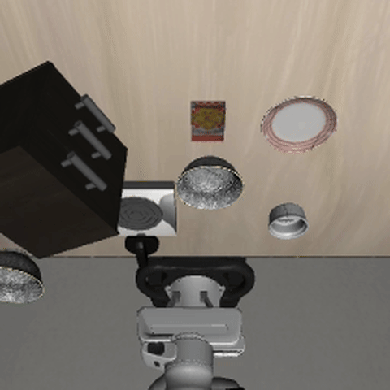

*Code: [GitHub](https://github.com/revanthgundala/soma)*



## The question

Standard vision-language-action models give the robot's language model 256 tokens to describe what the camera sees — one patch token per 14×14 pixel block. That's the full resolution output of the vision encoder, concatenated directly into the context.

What if you gave it 8 instead?

Not 8 random tokens. 8 *object* tokens, each learned through iterative attention over the 256 patches — one slot competing to represent one object in the scene. The idea is that a robot doesn't need a pixel-level description of the world. It needs to know: *what objects exist, where they are, and how they relate to each other.*

The core module is [Slot Attention](https://arxiv.org/abs/2006.15055) (Locatello et al., NeurIPS 2020), which learns to parse a scene into discrete object representations through unsupervised competitive attention. We're not the first to apply this to robotics — [SlotVLA](https://arxiv.org/abs/2511.06754) (Nov 2024) uses slot-based visual tokenizers for multitask manipulation, [STORM](https://arxiv.org/abs/2601.20381) (Jan 2026) attaches semantic-aware slots to frozen visual foundation models, and [Oat-VLA](https://arxiv.org/abs/2509.23655) (CoRL 2025) shows object-centric tokenization converges 2× faster than OpenVLA on LIBERO. The direction is clearly right.

What we specifically test: BO-QSA-style reconstruction pretraining on the raw patch tokens of **SigLIP** (the encoder inside PaliGemma), using a spatial broadcast decoder, before plugging the slots into a full VLA fine-tuning pipeline. This is a small-scale, fully reproducible test of whether the slot bottleneck helps when you're starting from a pure VLM with no manipulation priors.

We built **SOMA** (Slot Object Model for Actions) to test this. Then we trained an identical model without the compression — 256 raw patch tokens straight into the language model — and called it **NoSlot**. Same data, same architecture everywhere else, same training budget. The only variable is whether slot attention runs between the vision encoder and the language model.

Here's what happened.

## Results

| | SOMA (8 slots) | NoSlot (256 patches) |
|---|---|---|
| Visual tokens | **8** | 256 |
| Stage 2 training loss (LIBERO fine-tuning) | **0.211** | 0.237 |
| LIBERO-Spatial sim SR | **10%** | 0% |

The slot model trains more efficiently (11% lower loss) and actually succeeds at some tasks. The patch model fails on everything.

**Scale note:** 10% is low compared to OpenVLA's 84.7% on the same benchmark. Our best guess for that gap is pretraining data scale — we used 100 robot episodes for Stage 1 (VLA pretraining on DROID-100); OpenVLA used 970,000. But the base model matters too: PaliGemma has no manipulation priors, while OpenVLA was pretrained specifically on robot data. This post is about the SOMA vs NoSlot comparison at fixed budget, not about competing with SOTA.

## Architecture

The key difference is a single module: **slot attention**, sitting between the SigLIP vision encoder and the Gemma language model.



**Slot attention** works through iterative competition. You initialize 8 learned slot vectors, then run several rounds of attention where each slot competes to explain a subset of the 256 patches. By the end, each slot has "won" a region — typically a coherent object or background. The slots are a bottleneck: the model *must* compress the scene into 8 summaries.

### Training stages

**Stage 0 — Slot pretraining:** The slot attention module is trained on [DROID-100](https://huggingface.co/datasets/lerobot/droid_100) (100 diverse robot episodes) with a reconstruction loss via a spatial broadcast decoder.

**Stage 1 — VLA pretraining:** The full pipeline (SigLIP → slots → Gemma + LoRA → flow matching head) is trained on DROID-100 to learn action prediction from robot demonstrations. This gives the model its manipulation priors before task-specific fine-tuning.

**Stage 2 — Task fine-tuning:** The model is fine-tuned on [LIBERO-Spatial](https://huggingface.co/datasets/lerobot/libero_spatial_image) — 10 pick-and-place tasks, 43 demonstrations each. The flow matching head predicts continuous 7-DoF actions via Euler integration.

For NoSlot, Stage 0 trains a linear projection from patch features to Gemma's input dimension — keeping the total training compute matched to SOMA rather than skipping the stage entirely. Stages 1 and 2 are identical except the 256 raw patch tokens go into Gemma directly.

## Training



SOMA reaches a lower Stage 2 loss and holds it across all 50 epochs. The gap isn't huge (0.211 vs 0.237), but it's consistent — there's no epoch where NoSlot crosses below SOMA.

## Simulation results

We ran both models on LIBERO-Spatial: 10 pick-and-place tasks, 20 rollout episodes each.



SOMA succeeds on tasks 2 and 3. NoSlot doesn't succeed at anything.

<em>Task 2 — "pick up the black bowl from table center" (60% SR)</em>

<em>Task 3 — "pick up the black bowl on the cookie box" (40% SR)</em>





## The scale wall

10% is far from OpenVLA's 84.7%. We used 100 pretraining episodes vs. 970,000; 43 fine-tuning demos/task vs. 500; and PaliGemma has no manipulation priors vs. a robot-trained base model. SOMA v3 (extra 50 epochs at lower LR) performed *worse* than v2 — we're already overfitting. The gap is a data and compute problem, not an architecture one.

## Takeaways

**Slot compression helps.** Within the same data budget, compressing 256 patch tokens into 8 object slots produces a model that trains more efficiently (11% lower loss) and succeeds at twice as many tasks (2 vs 0 out of 10). The bottleneck forces the visual representation to be compact and object-centric, which appears to make it easier for the language model to act on.

**Scale is likely the ceiling.** The absolute performance gap relative to SOTA is most plausibly explained by pretraining data scale and base model priors — not architecture. Slot attention is not a substitute for having seen 970,000 robot trajectories.

**What's next.** The natural next step is to apply this as a drop-in replacement inside a VLA that already has strong manipulation priors — something like [OpenVLA](https://openvla.github.io/) or [π0](https://www.physicalintelligence.company/blog/pi0). Replace their vision encoder's patch projection with our SlotAttention module, freeze everything else, and measure whether 8 slots can match or beat 256 patches when the base model is actually good. That's the experiment that would give a fair answer to whether slot compression is worth the complexity.

*Code and checkpoints: [github.com/revanthgundala/soma](https://github.com/revanthgundala/soma)*

*If you want to talk about this, reach out: [revanth.gundala@gmail.com](mailto:revanth.gundala@gmail.com)*

## Acknowledgements

Research supported with Cloud TPUs from [Google's TPU Research Cloud (TRC)](https://sites.research.google/trc/about/).
