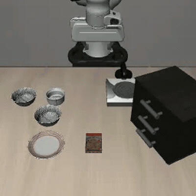

*Code: [GitHub](https://github.com/revanthgundala/siglip-grpo)*



## The idea

[SRPO](https://arxiv.org/abs/2511.15605) showed that a robot policy can improve itself by watching its own attempts. Starting at 48.9% success on LIBERO manipulation tasks, OpenVLA climbs to **99.2%** through self-play. The trick is using [V-JEPA 2](https://ai.meta.com/blog/v-jepa-2-video-understanding-model/) — a 1.1B-parameter video encoder — to score how close each failure was to success. Near-misses get more reward than total failures, and the policy learns from that gradient via GRPO.

But V-JEPA is expensive: ~5GB extra VRAM[^1], 4× A100s, and an entirely separate model. We thought we could skip it.

OpenVLA already has a vision encoder — **SigLIP** (400M params) — computing embeddings on every forward pass. Those embeddings are free. If they're good enough to compare trajectories, self-improvement costs nothing: no extra model, no extra VRAM, one GPU.

We added a small temporal MLP on top (inspired by [GR00T N1](https://github.com/NVIDIA-Omniverse/Isaac-GR00T)) to give the image encoder some notion of time, and called it SigLIP-T. Total overhead: ~200K parameters vs V-JEPA's 1.1B.

We spent $25 on a single A10G to test it.





## What we built

| | SRPO | SigLIP-T (Ours) |
|---|---|---|
| **Reward encoder** | V-JEPA ViT-G | SigLIP (from VLA) + TemporalMLP |
| **Extra parameters** | 1.1B | ~1.6M |
| **Extra VRAM** | ~5 GB | 0 |
| **Hardware** | 4× A100 | 1× A10G |
| **Total cost** | Not reported (cluster) | **$25** |

The training loop mirrors SRPO exactly: roll out on tasks, embed trajectories, compute rewards via cosine similarity to successful trajectories, update the policy with GRPO. We used the SRPO authors' fine-tuned OpenVLA 7B with LoRA[^2], 5 LIBERO-Spatial tasks, 8 rollouts per task, 10 iterations. Gradient checkpointing kept peak VRAM at 15.22 GB.

Most RL for robotics uses binary rewards. SRPO's insight is that a good encoder gives *nuanced* rewards — "you almost opened the drawer" scores higher than "you didn't move." This is what we were trying to replicate cheaply.

<em>Total failure — reward: 0.004</em>

<em>Near-miss — reward: 0.596</em>

## What happened

Nothing. After 10 iterations of rollout → embed → reward → update, the success rate started at 55% and ended at 55%.



The pipeline ran fine — no NaN losses, no crashes. But the GRPO loss oscillated between 0.37–0.55 with no downward trend. Gradient norms were stable (6–11) but pointing in random directions. PPO ratios drifted to 0.73–0.80 — the policy moved away from the reference, but not toward anything useful.



The problem was the reward signal. SigLIP-T assigned nearly identical scores to every failure: average failed reward 0.13–0.21 on a [0, 0.6] scale. The model couldn't tell a near-miss from a total whiff.



Per-task, two problems compound. Hard tasks (Task 0 at ~30%, Task 1 at 0%) get weak or zero reward signal. Easy tasks (Task 2 at 94%, Task 3 at 83%) are already near ceiling with few failures to learn from.





## Digging in

We ran a diagnostic on 10 tasks × 8 rollouts to figure out why the rewards were blind.

**Mean-pooling was burying the signal.** A trajectory is ~220 frames, but the first 150+ are the robot idling. The critical action happens in the last 20–30 frames. Averaging everything drowns the useful frames. Pooling only the last K frames gave up to 2.3× more trajectory separation:



**But it didn't help.** We re-trained with last-20 pooling — same result. The reward formula normalizes distances within each task's failure group, so absolute spread doesn't matter. What matters is whether different failures land at *different* distances from success. They all cluster together regardless of pooling.

| Metric | All-Frame | Last-20 |
|---|---|---|
| Avg success rate (4 iters) | 51.9% | 50.0% |
| Avg failed reward | 0.182 | 0.183 |



## What actually went wrong

While writing this post, I realized the temporal MLP was never trained. It stayed at random initialization for the entire experiment.

The reward computation converts embeddings to numpy arrays before computing cosine similarity — `.detach().cpu().numpy()`. This breaks the gradient chain. No gradient ever flows back into the MLP. Its weights never moved from their random initialization.

SRPO's V-JEPA is also frozen during RL. But V-JEPA was *pretrained on video* — it already understands trajectory dynamics. Our MLP had no pretraining. It was adding random noise to SigLIP's embeddings.

So we didn't test "SigLIP + temporal understanding." We tested "SigLIP + noise." And SigLIP alone — an image encoder trained on static image-text pairs — can't tell trajectories apart.



## Takeaways

Raw SigLIP embeddings can't drive trajectory reward. That part is real — the diagnostic data confirms it. But we can't say whether a *trained* temporal component would help, because we never actually trained one.

The pipeline works. The GRPO infrastructure is solid — stable gradients, correct PPO ratios, all on a single GPU for $25. The open question is whether pretraining the temporal MLP (e.g., with contrastive learning on trajectory pairs) could bridge the gap, or whether video-level pretraining like V-JEPA is fundamentally required.

*If you have questions or want to chat about this, feel free to reach out — [revanth.gundala@gmail.com](mailto:revanth.gundala@gmail.com)*

[^1]: V-JEPA ViT-G has 1.1B parameters. At bf16 (2 bytes/param), weights require ~2.2 GB. The remaining ~2.8 GB comes from intermediate activations and KV cache.

[^2]: Our base policy started at 55% success on LIBERO-Spatial before any RL. SRPO reports 48.9% — the difference is we used a different OpenVLA checkpoint (the SRPO authors' task-specific fine-tune, which starts higher).